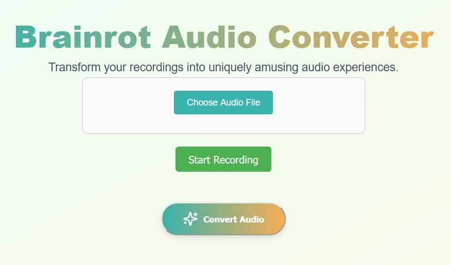

# Brainrot-Audio-Creator
The Brainrot Audio Creator allows you to take an audio file of a song and replace the lyrics with a goofy sound effect to create a fun, brainrot-inspired remix. This tool is perfect for those who enjoy creating hilarious audio clips for their favourite apps like Tiktok or Instagram Reels. This project consists of a simple HTML, CSS and JS frontend and a Python backend. The backend consists of packages such as Spleeter by Deezer, librosa and pydub to allow us to separate the lyrics from the instrumentals before processing them.

<div align="center">
  
</div>

## Features

- Upload any audio file from common file extensions (e.g., MP3, WAV, OGG)
- Insert a pre-defined goofy sound effect inplace of the lyrics.
- Output the transformed audio with the goofy sound replacing the selected sections.

## Installation

1. **Clone the Repository**

   ```bash
   git clone https://github.com/yourusername/Brainrot-Audio-Creator.git
   cd Brainrot-Audio-Creator
   ```

2. **Set Up the Environment**

   Using **pip**:

   ```bash
   python3 -m venv venv
   source venv/bin/activate  # On Windows: venv\Scripts\activate
   ```

   Or using **Miniconda**:

   ```bash
   conda create -n myenv python=3.8
   conda activate myenv
   ```

3. **Install Dependencies**

   ```bash
   pip install -r requirements.txt
   ```
### Run Locally

1. **Run npm in a terminal**\
    You may need to install the following dependencies:
    ```bash
   npm install vite
    ```
    Run:
    ```bash
   cd .\brainrot-vite
    ```
    ```bash
   npm run dev
    ```

2. **Run server in a new terminal** \
   You may need to install the following dependencies:
    ```bash
   npm i express cors
    ```
    Run:
    ```bash
   cd .\backend
    ```
    ```bash
   node server.js
    ```

3. **Run vocalSplitter.py to create file locally**

    ```bash
   backend\createAudio\vocalSplitter.py
    ```

## Usage
Simply upload your audio file when selecting the upload button. The lyrics to the audio will then be replaced by the sound effect, creating the brainrot audio for you to download!

## License

This project is licensed under the MIT License - see the LICENSE file for details.
